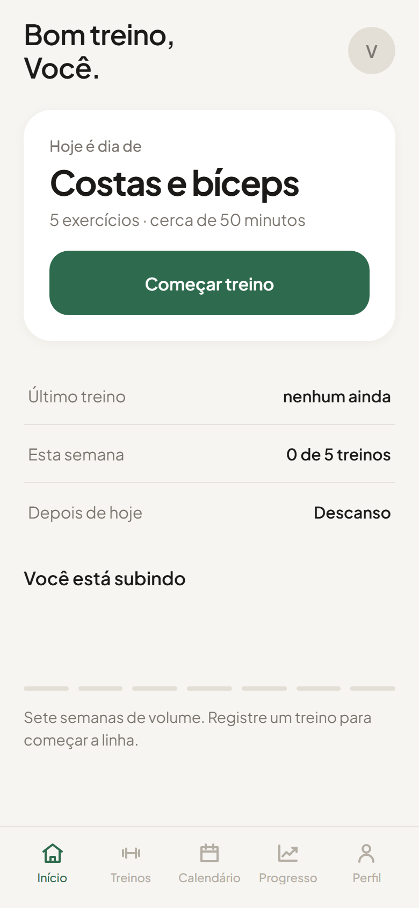
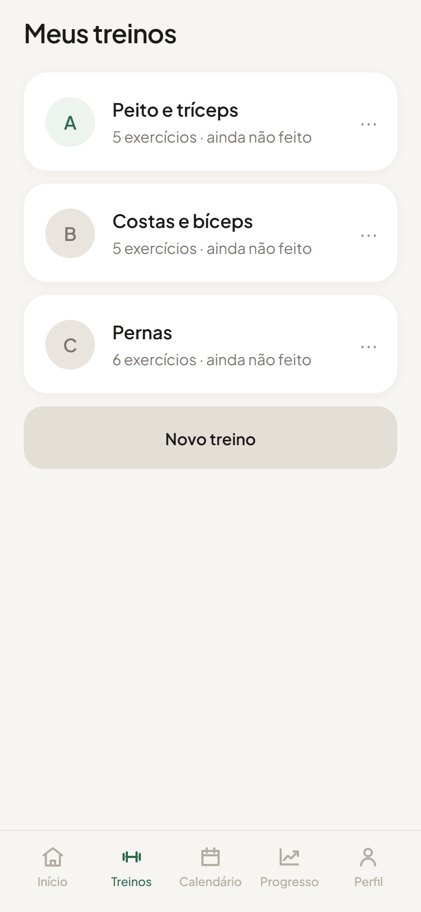
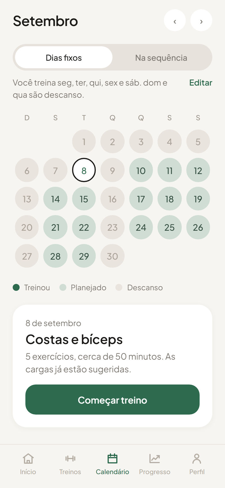
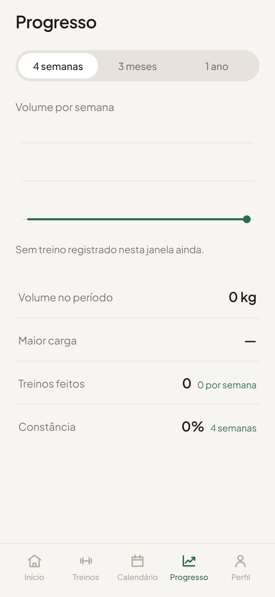
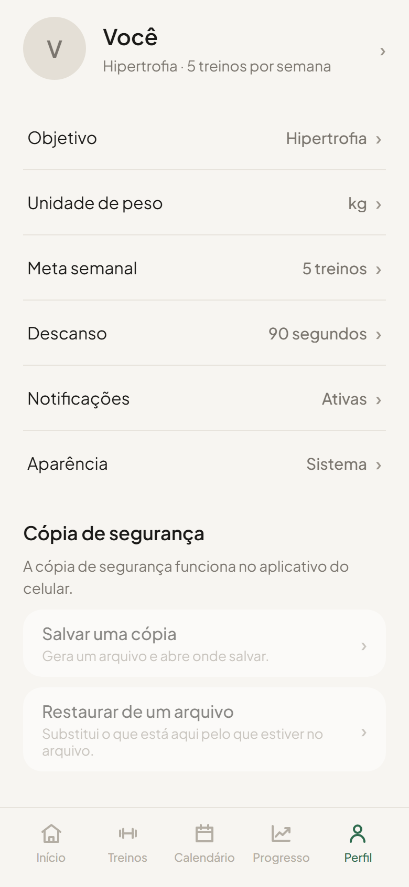

# NoteGym

Registro de treino de academia — carga e repetições série a série, comparando
com a última vez. Sem conta, sem nuvem: os dados ficam no aparelho.

**▶️ Testar no navegador: <https://leomoraessantdev.github.io/NoteGym/>**
&nbsp;·&nbsp; 📱 Instalar no Android: [DISTRIBUICAO.md](DISTRIBUICAO.md)

<p align="center">
  
  
  
  
  
</p>

<p align="center"><sub>Início · Treinos · Calendário · Progresso · Perfil</sub></p>

## O que faz

- **Início** — o treino do dia e o botão para começar.
- **Treinos** — monta os treinos (A/B/C…), exercícios, séries e faixa de repetições.
- **Execução** — marca série a série; cada check grava na hora. Cronômetro de
  descanso que avisa mesmo com a tela travada. Sugere subir a carga quando você
  fecha o topo da faixa de repetições.
- **Calendário** — dias fixos da semana ou treino na sequência.
- **Progresso** — volume por semana, maior carga, constância.
- **Perfil** — objetivo, unidade (kg/lb), descanso padrão, tema claro/escuro,
  cópia de segurança em arquivo.

## Como foi construído

- **Expo SDK 57 · React Native 0.86 · expo-router** (rotas por arquivo)
- **`expo-sqlite`** no aparelho, com migrações versionadas e seed inicial.
  No preview web o mesmo SQL roda em `sql.js` sobre `localStorage` — mesma
  camada de dados, mesmos testes.
- **TypeScript strict**, sem `any`. Regras de negócio (calendário, progressão,
  backup) isoladas em funções puras e cobertas por **Jest** (`npm test`).
- Tema claro/escuro montado em build-time por paleta, para a troca repintar na hora.
- Offline de verdade: nenhuma request de rede em runtime.

## Rodar localmente

```bash
npm install
npm start          # Metro — escaneia o QR no app Expo Go
npm run web        # preview no navegador (abre em /NoteGym)
npm test           # 42 testes
npm run typecheck
```

> Expo mudou bastante na v57 — os docs versionados são a referência:
> <https://docs.expo.dev/versions/v57.0.0/>

## Estrutura

```
app/            rotas (expo-router): as abas + a tela de execução do treino
src/
  components/   UI — steppers, bottom sheets, cartões, gráficos, ícones
  screens/      uma tela por aba
  state/        AppStore (contexto) + o "runner" que conduz o treino
  db/           schema, migrações, seed, queries, backup
  theme/        tokens de cor e o tema claro/escuro
  lib/          datas, unidades, formatação, notificações
  data/         regras de calendário e de backup — puras e testadas
```

## Distribuição

APK Android pronto + passo a passo em **[DISTRIBUICAO.md](DISTRIBUICAO.md)**.
Build e updates OTA pela EAS. iPhone precisa de conta Apple Developer.

## Licença

MIT — veja [LICENSE](LICENSE).
